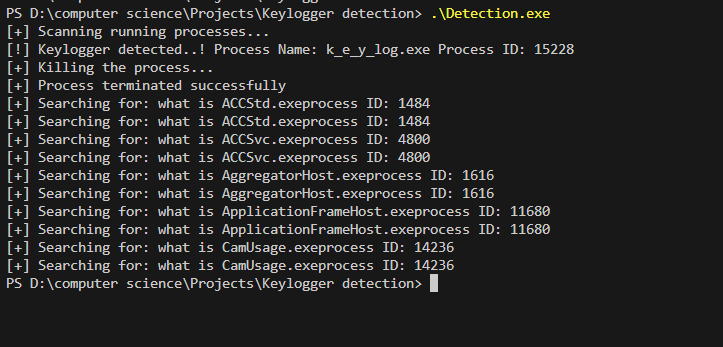

# Keylogeer ditection for Windows
## Description

This is a keylogger detection tool for windows. First A keylogger is a type of surveillance software that has the capability to record every keystroke you make to a log file, usually encrypted. A keylogger recorder can record instant messages, e-mail, and any information you type at any time using your keyboard. The log file created by the keylogger can then be sent to a specified receiver. Some keylogger programs will also record any e-mail addresses you use and Web site URLs you visit.
- Types of keyloggers:
    - Hardware keyloggers: These are physical devices that are attached between your keyboard and your computer. They are easy to use and don't require any software installation. They can be detected by checking the back of your computer for any suspicious device.
    - Software keyloggers: These are programs that are installed on your computer. They can be detected by checking the list of running processes on your computer.
        - User-mode keyloggers: These are the most common type of keyloggers. They run in the user space and can be detected by checking the list of running processes on your computer.
        - Kernel-mode keyloggers: These are more advanced keyloggers that run in the kernel space. They are harder to detect and require more advanced techniques to remove.

## How to use

first run a keylogger on your system and then compile cpp file `Detection.cpp`
```bash
 g++ -o test.exe Detection.cpp -lwininet -lwinhttp    
```
then run the compiled file
```bash
./Detection.exe
```
 

It will detect keylogger if exists on your system.

if you want to check if its running or not then first run any keylogger given in this repo and then run the Detection.exe file.

## How It works

It works by checking the running processes on the system and then checks if any of the running processes are keyloggers or not. It checks for the following keyloggers:
- First it check for some common keyloggers like `keylogger.exe`, `keylogger32.exe`, `keylogger64.exe`, `keyloggerx86.exe`, `keyloggerx`, and so on...
- Then it checks for the keyloggers that are running in the background and are hidden from the user.
    - if its running in the background then it will kill the process and give you the message that the keylogger is detected and killed successfully.
    - if its not running in the background then it will give you the message that the keylogger is not detected.

- If no keylogger is detected at first
    - then it will search each file running in the system on internet and check if it is a keylogger or not or any malicious file.
    - if it finds any information about the file on the internet then it will give you the json response of the file and save it in the `search_results.txt` file.
    - if it does not find information then it will save save those filenames in saperate file `not_found.txt` file.


### Some other ways to detect keyloggers

- Check the list of running processes on your computer: You can use the Task Manager to check the list of running processes on your computer. Look for any suspicious processes that you don't recognize.
- Use an anti-keylogger program: There are many anti-keylogger programs available that can help you detect and remove keyloggers from your computer.
- Use a keylogger detection tool: There are many keylogger detection tools available that can help you detect keyloggers on your computer. These tools can scan your computer for keyloggers and remove them if they are found.
- Check for hardware keyloggers: If you suspect that someone has installed a hardware keylogger on your computer, you can check the back of your computer for any suspicious devices.

